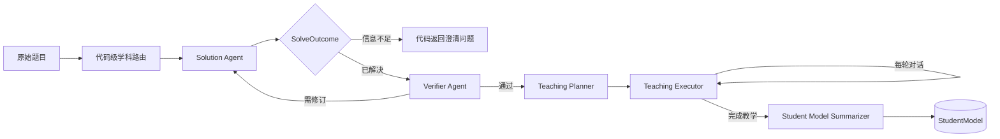

# susuAgent v0.2

susuAgent 是一个面向个性化教学实验的多 Agent 原型。v0.2 将“解题正确性”“教学策略”和“面向学生的表达”拆分为不同职责，并通过结构化 artifact 与代码级状态机连接。

当前版本处于本地实验阶段，已接入数学教案、SQLite 会话状态、长期 StudentModel、命令行交互和可视化测试网页。

## 核心设计

v0.2 包含五层 Agent：

1. **Solution Agent（求解）**：分析原题，生成结构化 `SolveOutcome` 与 `Solution`。
2. **Verifier Agent（验证）**：验证最终答案、显式推导以及 SolutionStep 与教案步骤的匹配关系。
3. **Teaching Planner（教学规划）**：结合已验证的解法、StudentModel 与 TeacherModel，生成教学策略图。
4. **Teaching Executor（表达）**：读取当前策略节点、TeachingState 和最近对话，生成本轮面向学生的自然语言回复。
5. **Student Model Summarizer（总结）**：在教学完成后汇总学习证据，并按需更新 StudentModel。

五层 Agent 并不会在每轮对话中全部运行：



- **每道题一次或低频运行**：学科路由、求解、验证、教学规划。
- **每轮运行**：Teaching Executor。正常主路径只有一次模型调用。
- **教学结束后运行**：Student Model Summarizer。

`StudentModel` 和 `TeacherModel` 是跨会话模型，`TeachingState` 是题目级短期状态。系统还为未来的 `personal_ai` 层预留了 `principal_id`、`consent_scope`、`data_classification` 和 `encryption_ref`，但当前不保存加密密钥。

更详细的设计说明见 [v0.2 架构文档](docs/v0.2-architecture.md)。

## v0.2 的关键约束

### 题目状态由代码管理

Solution Agent 返回 `SolveOutcome`：

- `solved`：必须包含完整 Solution，随后进入验证层；
- `incomplete` / `ambiguous`：必须给出澄清问题，不进入验证层；
- `unsupported`：表示当前教案不支持该题目，同样不进入验证层。

题目状态保存在 `TeachingState.original_problem.status`，不会由下游 Agent 随意改写。

### Solution v2

Solution 只描述解题事实，包括：

- `goal`、`known_conditions`、`assumptions`；
- 分步推导、步骤结果和供教学使用的候选问题；
- 最终答案与必要的结果核验；
- 每个步骤的稳定 `concept_ids`。

`concept_ids` 不参与答案正确性判断，只用于教学策略、LearningEvidence 和最终总结之间的对齐。学生易错点由 Teaching Planner 的 `anticipated_difficulties` 统一负责。

### Verifier 的职责边界

Verifier 的上下文只包含：

```text
origin_problem + solution + referenced lesson_plan sections
```

它不接收 StudentModel、TeacherModel、完整 TeachingState、教学话术或学生困难预测。验证失败后，Solution Agent 会同时收到上一版 Solution 和 VerificationReport，在原解答上定向修订。

### 结构化输出和状态契约

Agent 输出会依次经过：

1. JSON/Pydantic Schema 校验；
2. artifact 引用关系校验；
3. TeachingState 与策略图运行契约校验；
4. 校验通过后的数据库写入。

格式或契约不合法时，系统可将具体错误反馈给对应 Agent，进行有限次数的自动修复。未通过校验的表达不会展示给学生，也不会写入状态。

## 快速开始

### 1. 创建虚拟环境

在项目根目录执行：

```powershell
python -m venv .venv
& .\.venv\Scripts\Activate.ps1
python -m pip install -r requirements.txt
```

如果 PowerShell 不允许执行激活脚本，也可以始终直接使用 `& .\.venv\Scripts\python.exe` 运行项目。

### 2. 配置环境变量

复制示例配置：

```powershell
Copy-Item .env.example .env
```

然后在 `.env` 中填写模型服务的 API Key。不要将真实密钥写入 `.env.example` 或提交到版本库。

使用 OpenAI：

```dotenv
OPENAI_API_KEY=your_api_key
AGENT_MODEL=gpt-5.4-mini
```

使用 DeepSeek：

```dotenv
DEEPSEEK_API_KEY=your_api_key
AGENT_MODEL=litellm/deepseek/deepseek-chat
OPENAI_AGENTS_DISABLE_TRACING=true
```

DeepSeek 不使用原生 JSON Schema 响应格式；项目会自动切换为“JSON 文本输出 + 本地 Pydantic 校验”。

### 3. 启动网页测试界面

推荐直接运行：

```powershell
& .\test_web
```

也可以手动启动：

```powershell
& .\.venv\Scripts\python.exe .\local_web\server.py
```

默认地址为 [http://127.0.0.1:8765](http://127.0.0.1:8765)。如需修改端口或禁止自动打开浏览器：

```powershell
& .\.venv\Scripts\python.exe .\local_web\server.py --port 9000 --no-browser
```

网页左侧可以查看当前会话、题目状态、教案步骤、Solution、VerificationReport、TeachingStrategy、TeachingState 和 StudentModel。进行新架构测试时建议点击“新对话”，避免把旧会话中的教学进度误认为本轮结果。

### 4. 启动命令行版本

```powershell
& .\.venv\Scripts\python.exe .\src\main.py
```

命令行支持：

- `/new`：创建新会话；
- `/history`：查看并切换历史会话；
- `/status`：显示当前 session ID 和 TeachingState；
- `/exit`：退出。

## 配置项

| 变量 | 默认值 | 说明 |
| --- | --- | --- |
| `AGENT_MODEL` | `gpt-5.4-mini` | 所有 v0.2 Agent 共用的模型 |
| `*_MODEL` | 空 | 覆盖某个具体 Agent 的模型 |
| `COURSE_SUBJECT` | `math` | 当前学科路由；目前只注册了数学教案 |
| `COURSE_GRADE` | `unknown` | 当前课程年级 |
| `STUDENT_ID` | `default_student` | 长期学生模型标识 |
| `SESSION_DB_PATH` | `data/sessions.db` | 会话、状态和学生模型数据库 |
| `MAX_SOLUTION_REVISIONS` | `2` | 语义验证失败后的最大解法修订次数 |
| `MAX_ARTIFACT_REPAIRS` | `1` | 一次性 Agent 的 Schema/契约修复次数 |
| `MAX_EXECUTION_REPAIRS` | `1` | 表达输出的跨轮状态契约修复次数 |
| `LOG_LEVEL` | `INFO` | 终端日志等级 |
| `LOG_TO_FILE` | `true` | 是否写入文件日志 |

可通过 `MATH_SOLUTION_MODEL`、`SOLUTION_VERIFIER_MODEL`、`TEACHING_PLANNER_MODEL`、`TEACHING_EXECUTOR_MODEL` 和 `STUDENT_MODEL_SUMMARIZER_MODEL` 分别覆盖各层模型。完整配置见 [.env.example](.env.example)。

## 测试

运行全部自动化测试：

```powershell
& .\.venv\Scripts\python.exe -m unittest discover -s test -v
```

执行静态编译检查：

```powershell
& .\.venv\Scripts\python.exe -m compileall -q src local_web test
```

当前测试覆盖 Solution/SolveOutcome Schema、状态迁移、教案引用、验证与规划契约、开放问题生命周期、StudentModel 乐观锁以及网页 bootstrap 数据。

## 项目结构

```text
susuAgent/
├── src/
│   ├── main.py                         # 命令行入口
│   └── susu_agent/
│       ├── agents/                     # 五层 Agent 及上下文构造
│       ├── instructions/               # Agent 指令
│       ├── repositories/               # TeachingState / StudentModel 持久化
│       ├── schemas/                    # Pydantic 与 JSON Schema
│       ├── orchestrator.py             # v0.2 编排和代码级状态机
│       └── lesson_plan_loader.py       # 学科教案加载与上下文选择
├── lesson_plans/                       # 按学科组织的教案
├── local_web/                          # 本地测试网页和 HTTP 服务
├── test/                               # 自动化测试
├── docs/v0.2-architecture.md           # 详细架构说明
├── data/                               # SQLite 数据库
└── logs/                               # 运行日志
```

## 教案扩展

当前只提供 `math` 路由。每个学科需要在 `lesson_plans/<subject>/` 中提供 `lesson_plan.json`、指令文件和上下文文件。程序只加载清单中明确列出的文件，不会自动扫描整个目录。

新增学科时应：

1. 创建新的学科目录与 `lesson_plan.json`；
2. 使用稳定的教案步骤 ID；
3. 配置 `instruction_files`、`context_files` 和对应章节；
4. 将 `COURSE_SUBJECT` 设置为新学科名；
5. 为路由、上下文选择和状态持久化补充测试。

详细格式见 [lesson_plans/README.md](lesson_plans/README.md)。

## 状态迁移与调试

TeachingState 当前使用 schema version 6。旧状态会自动迁移；从 v5 升级时会保留可迁移的 Solution，但旧 VerificationReport 和 TeachingStrategy 会失效，并在下一次进入会话时按新契约重新生成。

常见错误含义：

- `Solution verification remained needs_revision...`：解法仍有语义或数学问题，不是单纯 JSON 格式错误；可查看侧栏中的 VerificationReport。
- `could not produce valid ...`：模型输出在允许的自动修复次数内仍未满足 Schema 或运行契约。
- `no registered lesson plan`：`COURSE_SUBJECT` 没有对应的已注册教案。
- API 请求或鉴权失败：检查 `.env` 中的 Key、模型名称和 provider 前缀。

日志默认写入 `logs/`，会话数据默认保存在 `data/sessions.db`。调试时不要直接修改正在运行中的 SQLite 文件。

## 当前边界

- 当前仅提供数学教案与显式学科配置，尚未实现通用自动学科分类。
- Verifier 能降低错误率，但不能形式化保证所有数学结论正确；高风险场景仍应增加确定性计算、符号验证或人工复核。
- `personal_ai` 目前只是数据结构预留，尚未实现数字身份、授权协议和密钥管理。
- Web 界面用于本地实验，不包含生产环境所需的账户、鉴权、并发隔离和部署安全能力。
