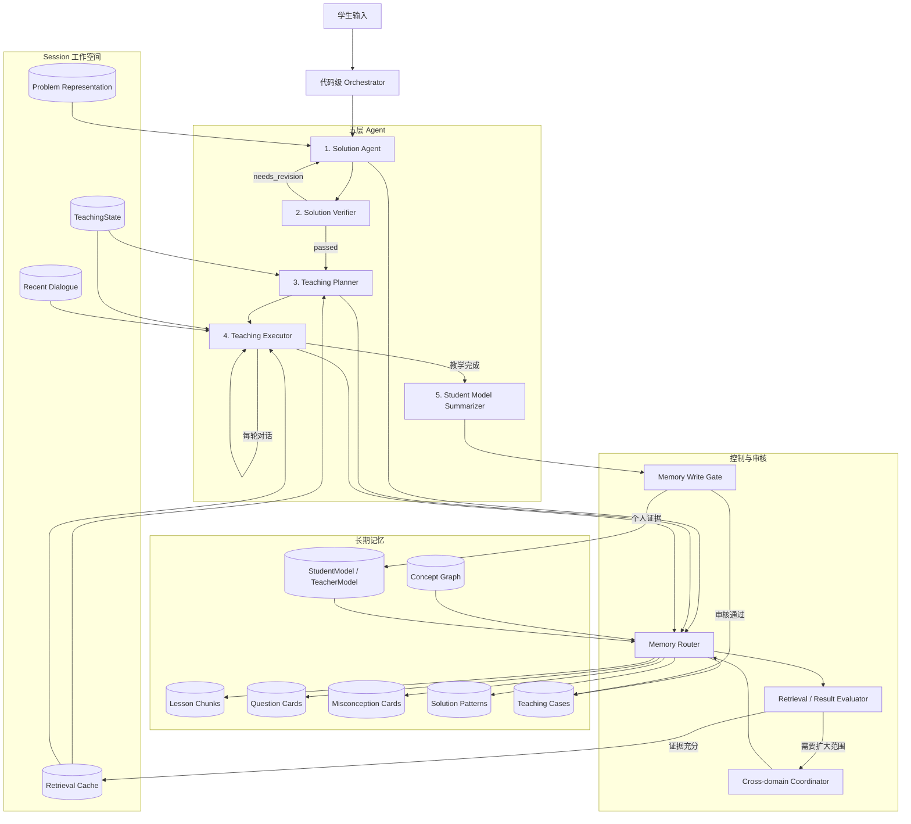
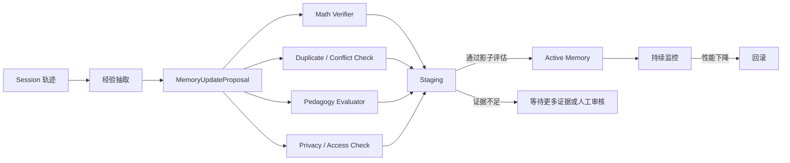

# susuAgent v0.3

susuAgent 是一个面向个性化数学教学实验的多 Agent 原型。v0.3 在 v0.2 的五层 Agent、结构化 artifact 和代码级状态机之上，引入分层记忆、分域检索、审核门控的知识演化，以及基于失败类型的跨知识域协作。

v0.3 不试图机械复制人脑。它只借鉴长期记忆、工作记忆、认知控制和元认知审核等功能分工，同时利用机器外部记忆容量大、可检索、可复现、可审计和可回滚的优势。

> **实现状态**：v0.3 主路径已经实现。五层 Agent、ProblemRepresentation、分类型记忆、词法与本地可重建向量混合检索、Solution Pattern、Question/Misconception Card 路由、渐进扩域、SQLite 权威记录、审核门控提案、版本与回滚均已接入。`MEMORY_ENABLED=false` 时仍保持 v0.2 的模型调用和输出兼容；生产环境可将本地哈希向量器替换为外部 Embedding/Reranker，而不改变权威记录。

## 一、设计目标

v0.3 聚焦一个问题：

> 如何让教学 Agent 在保证数学正确性、教学状态一致性和个人数据隔离的前提下，检索并积累可复用的教学经验，持续改善下一次教学决策？

系统遵循以下原则：

1. **正确性优先于个性化**：未经验证的解法不能进入教学规划。
2. **记忆是外部证据，不是新的真理来源**：召回结果必须带来源、版本、置信度和适用范围。
3. **共享访问能力，不共享同一份上下文**：各 Agent 访问同一记忆底座，但只获得职责所需的最小投影。
4. **长期数据与向量索引分离**：文件、SQLite 或未来的关系数据库保存权威记录；向量数据库保存可重建的检索索引。
5. **Agent 只能提出长期记忆更新**：全局知识写入必须经过确定性校验、专用 Verifier 或人工审核。
6. **失败必须分类**：检索缺失、排序错误、推理错误、数学错误和教学不匹配不能混为一个 `failed`。
7. **先检索专业域，再渐进扩大**：局部知识不足时才触发关联域检索或跨 Agent 协作。
8. **长期优化依赖学习证据**：学生当下说“懂了”不能单独证明一次教学策略有效。

## 二、总体架构

v0.3 由“控制平面”和“记忆平面”组成。五层 Agent 属于控制平面；长期知识、个人模型和 Session 工作空间属于记忆平面。



正常主路径仍然保持三个运行频率：

1. **每道题一次或低频运行**：题目结构化、Solution Agent、Verifier、教学检索和 Teaching Planner。
2. **每轮运行**：Teaching Executor；正常轮次保持一次生成调用，检索和状态校验由代码完成。
3. **教学结束后运行**：Student Model Summarizer 生成个人模型和经验记忆的更新提案，Memory Write Gate 决定是否写入。

## 三、v0.3 的记忆模型

### 3.1 长期记忆不是一个无类型的大向量池

长期记忆按用途划分为多个逻辑知识域。初期可以使用同一个向量引擎中的不同 Collection 或 Namespace，不必运行多个数据库服务。

| 知识域 | 内容 | 主要使用者 |
| --- | --- | --- |
| `lesson_chunks` | 按标题和语义边界拆分的教案内容 | Solution、Verifier、Planner |
| `question_cards` | 可复用开放问题、适用条件、检查点和提示阶梯 | Planner、Executor |
| `misconception_cards` | 常见错因、诊断信号、反例和纠正策略 | Executor、Summarizer |
| `solution_patterns` | 题目结构、解题范式和方法适用边界 | Solution |
| `teaching_cases` | 经审核的题目—学生状态—教学动作—结果案例 | Planner、Summarizer |
| `concept_graph` | 概念、前置关系、类比、对立和迁移关系 | Router、各专业检索器 |
| `student_memory` | 单个学生的长期掌握、误区和偏好 | Planner、Executor、Summarizer |
| `teacher_policy` | 全局教学原则和经过验证的策略 | Planner、Executor |

“全 Agent 共享大知识库”在 v0.3 中表示共享受控访问能力，而不是把所有召回内容注入每个 Agent。`target_agents`、`subject`、`task_stage`、`concept_ids`、`lesson_plan_step_ids`、`student_id` 和权限范围共同决定可见内容。

### 3.2 权威存储与检索索引分离

以下内容继续由结构化存储保存：

- Lesson Plan 原文和清单；
- TeacherModel 和 StudentModel；
- TeachingState；
- 题目、Question Card、Misconception Card 之间的人工或审核关系；
- 记忆版本、来源、置信度和审核记录。

向量库只保存上述记录的检索投影。更换 Embedding 模型后，可以从权威记录重建全部向量，不允许把向量库作为唯一事实来源。

### 3.3 Session 工作空间

工作记忆继续以 `TeachingState` 为核心，并增加题目结构投影和检索缓存：

```text
SessionWorkspace
├── original_problem
├── problem_representation
│   ├── objects
│   ├── conditions
│   ├── goal
│   ├── structural_features
│   └── concept_ids
├── verified_solution
├── verification_report
├── teaching_strategy
├── current_strategy_node_id
├── open_question_history
├── learning_evidence
├── recent_dialogue
└── retrieval_cache
```

Session 内容能够直接放入上下文时，不强制使用向量检索。只有对话或题目材料超过预算、需要跨较长历史检索时，才为 Session 建立临时向量索引。Session 结束后，原始轨迹进入低信任事件日志；只有通过审核的抽象经验才能进入长期教学记忆。

## 四、题目与回答的结构化

v0.3 不把题目和学生回答只拆成关键词。关键词是检索信号之一，必须与语义文本和结构化特征共同使用。

题目首先形成 `ProblemRepresentation`：

```json
{
  "problem_id": "problem_001",
  "subject": "math",
  "goal_type": "extremum",
  "problem_type": "inequality",
  "objects": ["x", "y"],
  "conditions": ["x 与 y 满足给定约束"],
  "structural_features": {
    "degrees_of_freedom": 2,
    "symmetry": "unknown"
  },
  "concept_ids": [
    "degrees_of_freedom",
    "inequality_constraint",
    "extremum"
  ]
}
```

推荐的题目语义片段类型包括：

- `object`：研究对象；
- `condition`：条件、定义域和合法边界；
- `goal`：证明、求值、最值或构造目标；
- `structure`：自由度、对称性、动静关系和依赖；
- `representation`：函数、几何、向量或参数表示；
- `difficulty_signal`：潜在思维断点。

学生回答则绑定当前 Open Question、目标检查点和所在策略节点，不能脱离语境仅凭“求导”等关键词判定正确或归入某个错因。

## 五、五层 Agent 在 v0.3 中的职责

### 5.1 Solution Agent：题目理解与可验证求解

保留 v0.2 的 `SolveOutcome` 门控、结构化 Solution 和有限修订循环。

v0.3 中 Solution Agent 负责：

- 将原题解析成 `ProblemRepresentation`；
- 区分对象、条件、目标、自由度和合法边界；
- 通过 `solution_patterns` 和相关教案片段辅助求解；
- 输出可核验的步骤、结果和稳定 `concept_ids`；
- 在信息不足、歧义或教案不支持时返回明确状态。

它不负责：

- 根据学生水平决定教学顺序；
- 从单个关键词直接选择 Open Question；
- 更新 StudentModel；
- 把未经验证的解题经验写入长期记忆。

v0.2 中嵌在每道 Solution 里的 `tutor_questions` 在迁移期保留兼容，目标状态改为：Solution 只提供题目级候选教学意图和必要检查点；可复用的问题表达由 `question_cards` 检索，Teaching Planner 再针对本题适配。这样避免每道题重复生成相同教学问题。

### 5.2 Solution Verifier：数学正确性边界

保留并强化 v0.2 的 Verifier 隔离原则。它只接收：

```text
original_problem
+ problem_representation
+ solution correctness projection
+ solution 实际引用的教案证据
```

它不接收：

- StudentModel；
- TeacherModel 的表达偏好；
- Question Card 排序结果；
- 学生困难预测；
- 完整 TeachingState；
- 与当前证明无关的检索内容。

Verifier 区分数学错误、推导缺失、条件遗漏、教案错配和证据不足。验证失败后，Solution Agent 同时接收上一版 Solution 与 VerificationReport，定向修订受影响步骤。

### 5.3 Teaching Planner：记忆增强的教学策略规划

Teaching Planner 继续只处理已验证的 Solution。v0.3 在它运行前增加教学记忆检索：

```text
ProblemRepresentation
+ verified Solution
+ StudentModel 当前学科投影
+ lesson_plan_step_ids
+ concept_ids
→ 检索 Question Cards
→ 检索相关教案 Chunks
→ 检索经审核的 Teaching Cases
→ 重排
→ Teaching Planner
```

Planner 负责：

- 根据学生水平选择教学入口；
- 从候选 Question Card 中选择、改写和排序；
- 设计诊断问题、提示问题和解释节点；
- 为每个问题绑定目标检查点；
- 定义六类学生回答的状态转移；
- 控制答案披露边界；
- 在证据不足时声明需要扩大检索或重规划。

Question Card 不是单独的问题字符串，而是结构化教学记忆：

```json
{
  "question_card_id": "question_freeze_variable",
  "question_template": "面对多个自由度时，我们优先进行什么处理？",
  "teaching_goal": "引导学生通过冻结变量降低自由度",
  "expected_answer": "先固定部分变量，研究剩余变量的变化",
  "answer_checkpoints": [
    "识别多个独立变量",
    "提出冻结一个变量"
  ],
  "applicability": {
    "degrees_of_freedom_min": 2,
    "goal_types": ["extremum", "inequality"],
    "lesson_plan_step_ids": ["S3", "S6"],
    "concept_ids": ["degrees_of_freedom", "freeze_variable"]
  },
  "retrieval_text": "多自由度问题，变量相互制约，通过冻结一个变量降低系统自由度"
}
```

### 5.4 Teaching Executor：单轮表达、诊断与反馈

保留 v0.2 “每轮一次生成调用”和“只输出 feedback 与唯一 open_question”的边界。最终面向学生的文本仍由代码统一拼接。

Executor 接收：

- 当前策略节点；
- 当前 Open Question 及检查点；
- 已满足检查点；
- 最近对话；
- StudentModel 的最小相关投影；
- 与当前问题相关的 Misconception Cards 和提示片段。

分析学生回答时，检索请求必须包含当前问题语境：

```json
{
  "task_stage": "assess_student_answer",
  "target_agent": "teaching_executor",
  "current_question_id": "question_choose_method",
  "lesson_plan_step_id": "S3",
  "concept_ids": ["derivative", "degrees_of_freedom", "extremum"],
  "student_answer": "这个题可以直接求导"
}
```

Executor 不允许仅因回答中出现“求导”就判定为某一错因。它必须依据当前问题、Solution、预期答案和检查点进行判断。错因检索只提供候选解释，不覆盖策略图和代码级状态契约。

### 5.5 Student Model Summarizer：证据整合与记忆提案

保留 v0.2 的教学结束后低频总结和 StudentModel 乐观锁更新。v0.3 将其职责拆成两类输出：

1. `StudentModelPatch`：只影响当前学生，可依据明确学习证据增量更新。
2. `MemoryUpdateProposal`：面向全局 Question Card、Misconception Card 或 Teaching Case 的候选更新，不能直接生效。

它负责提取：

- 学生概念掌握变化；
- 可复现的错误模式；
- 哪个 Open Question 提供了有效诊断；
- 哪个提示帮助学生跨过断点；
- 是否存在迁移或保持证据；
- 哪些观察仍然证据不足。

单个学生的一次回答可以形成低置信度个人证据，但不能直接修改全局 TeacherModel 或全局教学知识。

## 六、检索、路由与“专业脑区”协作

“专业脑区”在 v0.3 中只是工程上的知识域与处理模块，不声称对应真实神经解剖区域。

### 6.1 统一检索请求

所有 Agent 通过统一 `RetrievalQuery` 访问记忆：

```json
{
  "subject": "math",
  "task_stage": "plan_instruction",
  "target_agent": "teaching_planner",
  "query_text": "二自由度不等式最值问题如何选择教学入口",
  "concept_ids": ["degrees_of_freedom", "extremum"],
  "lesson_plan_step_ids": ["S3", "S6"],
  "memory_types": ["question_card", "lesson_chunk", "teaching_case"],
  "student_id": "v02_test_student",
  "top_k": 8,
  "max_context_chars": 6000
}
```

### 6.2 混合评分

初始版本使用可解释的混合评分：

```text
score =
    dense_similarity
  + lexical_or_bm25_score
  + concept_match
  + lesson_step_match
  + task_stage_match
  + student_fit
  + source_confidence
  - staleness_penalty
```

其中权限、`target_agents`、学科和个人记忆范围是硬过滤，不参与软打分。先召回再用 Reranker 精排；在积累可靠正样本和硬负样本之前，不急于微调 Embedding。

### 6.3 渐进扩大检索

```text
一级：当前专业知识域
  ↓ 证据不足
二级：概念图相邻知识域
  ↓ 仍不足
三级：全局候选检索或跨 Agent 协作
```

跨域关系使用稳定 `concept_ids` 和有类型的知识边，例如：

- `is_a`；
- `prerequisite_of`；
- `can_be_reduced_by`；
- `analogous_to`；
- `contrasts_with`；
- `often_confused_with`；
- `used_in`；
- `transfers_to`。

Embedding 相似关系只能作为候选边；未经审核不能成为权威概念关系。

## 七、评估器与失败分类

专业检索或 Agent 结果未通过，不能直接推断为“该知识库不支持任务”。v0.3 使用以下失败类型：

| 类型 | 含义 | 默认动作 |
| --- | --- | --- |
| `retrieval_empty` | 没有候选 | 扩大知识域或改写查询 |
| `low_relevance` | 候选与任务不相关 | 调整过滤和排序 |
| `low_coverage` | 候选相关但缺少必要知识 | 沿概念图扩展 |
| `cross_domain_required` | 任务需要其他专业域 | 触发 Coordinator |
| `reasoning_failed` | 证据充分但 Agent 推理失败 | 带错误报告重试或升级模型 |
| `verification_failed` | 数学结论或推导错误 | 返回 Solution Agent 修订 |
| `pedagogical_mismatch` | 数学正确但不适合当前学生 | 返回 Planner 重规划 |
| `schema_invalid` | 输出不满足结构契约 | 有限格式修复 |
| `uncertain` | 评估器无法可靠判断 | 保守输出或请求人工确认 |

评估结果必须保留证据覆盖、引用、置信度和推荐动作，避免用一个不透明的总分控制整个系统。

## 八、审核门控的自我更新

v0.3 允许系统从教学经历中产生更新提案，但禁止生成 Agent 直接覆盖长期知识。



支持的记忆操作包括：

- `add`：新增；
- `reinforce`：增加支持证据；
- `weaken`：增加反例并降低置信度；
- `merge`：合并重复记忆；
- `supersede`：新版本取代旧版本；
- `quarantine`：隔离可疑记忆；
- `expire`：停止主动召回但保留历史；
- `rollback`：恢复旧版本。

个人与全局更新采用不同门槛：

- **StudentModel**：允许单次明确证据形成低置信度增量，并由后续证据加强或反驳。
- **全局 TeacherModel 和教学记忆**：要求多个独立案例、数学审核、教学效果证据，必要时要求教师确认。

原始 Session 轨迹不得自动成为高信任语义知识。系统先保留事件，再通过多次证据将其抽象为稳定模式。

## 九、v0.2 的保留、调整与删除

### 9.1 保留

- 五层 Agent 的职责分离；
- `SolveOutcome` 的 `solved / incomplete / ambiguous / unsupported` 分支；
- Solution v2 的显式推导和稳定 `concept_ids`；
- Solution Verifier 的最小上下文和有限修订；
- TeachingStrategy 图、六类回答转移和有限重试；
- TeachingState v7 的唯一策略游标；
- 每轮最多一个 Open Question；
- 检查点跨轮累积；
- StudentModel v3 的学科隔离和乐观锁；
- JSON/Pydantic、引用关系和运行状态的多层校验；
- Lesson Plan 的稳定步骤 ID、版本和内容摘要；
- 正常教学轮次一次模型生成调用的成本边界。

### 9.2 调整

- 从“向 Agent 注入完整教案”调整为“常驻总纲 + 按任务检索章节”；
- 从“每道 Solution 独立生成所有 TutorQuestion”调整为“Question Card 召回 + 本题适配”；
- 从纯词法教案补丁检索调整为词法、向量、元数据和知识边混合检索；
- 从只更新 StudentModel 调整为“个人模型更新 + 全局经验更新提案”；
- 从单一检索结果调整为带失败分类的渐进扩大检索；
- 从自由文本上下文调整为 `ProblemRepresentation`、`RetrievalQuery` 和 `RetrievalEvidence` 等结构化 artifact。

### 9.3 从 v0.3 主路径删除

- 删除所有 Agent 读取相同完整上下文的做法；
- 删除由关键词直接决定问题、错因或教学动作的规则；
- 删除 Agent 对全局知识库的无审核直接写入；
- 删除将向量库当作权威数据源的设计；
- 删除将一次 Session 的成功直接推广为全局策略的做法；
- 删除重复保存多个进度游标和重复问题文本的状态；
- 删除旧 `Tutor Agent` 和旧 `Teaching State Updater Agent` 在主路径中的独立职责：面向学生的表达由 Teaching Executor 负责，状态合并由代码级状态机负责。迁移完成前可保留兼容文件，但不得重新进入主编排。

## 十、关键结构化契约

v0.3 已实现以下 artifact：

### `MemoryItem`

```text
memory_id
memory_type
canonical_text
retrieval_text
subject
task_stages
target_agents
concept_ids
lesson_plan_step_ids
scope: global | subject | student | session
source / provenance
confidence
version
status
embedding_model
created_at / updated_at / expires_at
```

### `RetrievalEvidence`

```text
memory_id
source
matched_features
dense_score
lexical_score
metadata_score
rerank_score
reasoning_path
content_excerpt
```

### `MemoryUpdateProposal`

```text
operation
target_memory_id
candidate_content
supporting_evidence_ids
evidence_source_ids
counterexample_ids
rollback_version
proposed_confidence
scope
risk_flags
required_reviewers
```

所有 artifact 先经过 Schema 校验，再进入语义审核和状态更新。未通过校验的数据不展示、不写入权威状态，也不进入正式向量索引。

## 十一、实施路线

### Phase 0：保持 v0.2 可运行

- 冻结现有五层主路径行为；
- 为新增模块建立特性开关；
- 保证旧 Session 可以迁移或失效重建；
- 新增功能不改变默认测试结果。

### Phase 1：只读记忆检索

- 定义 `MemoryItem`、`RetrievalQuery` 和 `RetrievalEvidence`；
- 建立 `lesson_chunks`、`question_cards` 和 `misconception_cards`；
- 接入混合检索；
- 在 Verifier 通过后、Planner 运行前接入 Question Card 检索；
- 在 Executor 分析回答时接入 Misconception Card 检索。

### Phase 2：评估与跨域协作

- 增加检索覆盖和相关性评估；
- 实现失败分类；
- 建立 Concept Graph；
- 实现专业域、相邻域和全局域的渐进扩大；
- 记录每次召回是否实际被采用。

### Phase 3：审核门控更新

- 增加事件日志和 `MemoryUpdateProposal`；
- 实现重复、冲突、数学、教学和隐私审核；
- 增加 staging、版本、回滚和隔离区；
- 先允许 StudentModel 更新，再开放全局教学记忆更新。

### Phase 4：学习读取与写入策略

- 从已验证数据构建正样本和硬负样本；
- 训练或微调 Reranker；
- 评估何时检索、检索哪个知识域和 Top-K；
- 研究教学动作的延迟信用分配；
- 在可靠评估存在之前，不允许系统根据自评结果自动训练自身。

## 十二、研究与评估

v0.3 的核心研究对象不是“多个 Agent 能否工作”，而是：

> 审核门控的自演化教学记忆，能否在持续教学中提升问题诊断和学习效果，同时避免错误经验污染长期知识？

至少评估以下维度：

| 维度 | 指标示例 |
| --- | --- |
| 数学正确性 | 最终答案、推导和条件覆盖率 |
| 检索质量 | Recall@K、MRR、nDCG、证据覆盖率 |
| 诊断质量 | 错因识别准确率、检查点区分能力 |
| 教学质量 | Question Card 适切性、提示泄露程度 |
| 学习效果 | 前后测增益、保持和迁移表现 |
| 长期演化 | 随 Session 增加的性能曲线 |
| 记忆安全 | 错误写入率、冲突率、回滚率 |
| 系统效率 | Token、延迟、模型调用和检索成本 |

基线至少包括：同模型同预算单 Agent、无记忆多 Agent、静态 RAG、未审核自动写入、审核门控写入，以及人工理想记忆上界。模拟学生可用于开发和消融，但若要声明学习效果，应增加教师标注、独立模型评估和真实学生的后测或迁移测试。

## 十三、快速开始

### 1. 创建虚拟环境

```powershell
python -m venv .venv
& .\.venv\Scripts\Activate.ps1
python -m pip install -r requirements.txt
```

如果 PowerShell 不允许执行激活脚本，也可以始终直接使用 `& .\.venv\Scripts\python.exe` 运行项目。

### 2. 配置环境变量

复制示例配置：

```powershell
Copy-Item .env.example .env
```

然后在 `.env` 中填写模型服务的 API Key。不要将真实密钥写入 `.env.example` 或提交到版本库。

使用 OpenAI：

```dotenv
OPENAI_API_KEY=your_api_key
AGENT_MODEL=gpt-5.4-mini
```

使用 DeepSeek：

```dotenv
DEEPSEEK_API_KEY=your_api_key
AGENT_MODEL=litellm/deepseek/deepseek-chat
OPENAI_AGENTS_DISABLE_TRACING=true
```

DeepSeek 不使用原生 JSON Schema 响应格式；项目会自动切换为“JSON 文本输出 + 本地 Pydantic 校验”。

仓库提供一个测试学生。首次使用时运行：

```powershell
& .\.venv\Scripts\python.exe .\scripts\create_test_student.py --student-id v02_test_student
```

并在 `.env` 中设置 `STUDENT_ID=v02_test_student`。StudentModel 的当前文档与历次快照均保存在 `data/sessions.db`，同一学生的并发更新由模型版本乐观锁保护。

### 3. 启动网页测试界面

```powershell
& .\test_web
```

也可以手动启动：

```powershell
& .\.venv\Scripts\python.exe .\local_web\server.py
```

默认地址为 [http://127.0.0.1:8765](http://127.0.0.1:8765)。如需修改端口或禁止自动打开浏览器：

```powershell
& .\.venv\Scripts\python.exe .\local_web\server.py --port 9000 --no-browser
```

网页左侧可以查看当前会话、题目状态、教案步骤、Solution、VerificationReport、TeachingStrategy、TeachingState 和 StudentModel。进行新架构测试时建议点击“新对话”，避免把旧 Session 的教学进度误认为本轮结果。

### 4. 启动命令行版本

```powershell
& .\.venv\Scripts\python.exe .\src\main.py
```

命令行支持：

- `/new`：创建新会话；
- `/history`：查看并切换历史会话；
- `/status`：显示当前 Session ID 和 TeachingState；
- `/exit`：退出。

## 十四、当前配置项

以下配置属于当前 v0.3 运行基线。

| 变量 | 默认值 | 说明 |
| --- | --- | --- |
| `AGENT_MODEL` | `gpt-5.4-mini` | 所有 Agent 共用的默认模型 |
| `*_MODEL` | 空 | 覆盖某个具体 Agent 的模型 |
| `COURSE_SUBJECT` | `math` | 当前学科路由；目前只注册数学教案 |
| `COURSE_GRADE` | `unknown` | 当前课程年级 |
| `STUDENT_ID` | `default_student` | 长期学生模型标识 |
| `SESSION_DB_PATH` | `data/sessions.db` | Session、状态和学生模型数据库 |
| `MAX_SOLUTION_REVISIONS` | `2` | 语义验证失败后的最大解法修订次数 |
| `MAX_ARTIFACT_REPAIRS` | `1` | 一次性 Agent 的 Schema/契约修复次数 |
| `MAX_EXECUTION_REPAIRS` | `1` | 表达输出的跨轮状态契约修复次数 |
| `MEMORY_ENABLED` | `false` | 是否启用 v0.3 记忆检索与更新提案；关闭时兼容 v0.2 |
| `MEMORY_DB_PATH` | `data/memory.db` | 权威记忆、版本、提案、事件与可重建索引数据库 |
| `LOG_LEVEL` | `INFO` | 终端日志等级 |
| `LOG_TO_FILE` | `true` | 是否写入文件日志 |

可通过 `MATH_SOLUTION_MODEL`、`SOLUTION_VERIFIER_MODEL`、`TEACHING_PLANNER_MODEL`、`TEACHING_EXECUTOR_MODEL` 和 `STUDENT_MODEL_SUMMARIZER_MODEL` 分别覆盖五层模型。

## 十五、测试

运行全部自动化测试：

```powershell
& .\.venv\Scripts\python.exe -m unittest discover -s test -v
```

执行静态编译检查：

```powershell
& .\.venv\Scripts\python.exe -m compileall -q src local_web test
```

v0.3 新模块必须增加以下测试：

- Collection 和权限硬过滤；
- 混合检索排序与来源追踪；
- Question Card 和 Misconception Card 的适用条件；
- 检索失败分类与渐进扩大；
- 记忆更新提案的重复、冲突和版本校验；
- 未审核记忆不得进入正式索引；
- 全局记忆和学生私有记忆隔离；
- 回滚后检索结果恢复；
- 检索模块关闭时 v0.2 主路径保持兼容。

## 十六、项目结构

当前已存在结构：

```text
susuAgent/
├── src/
│   ├── main.py
│   └── susu_agent/
│       ├── agents/                 # 五层 Agent 与兼容 Agent
│       ├── instructions/           # Agent 指令
│       ├── repositories/           # TeachingState / StudentModel 持久化
│       ├── memory/                 # 路由、混合检索、评估、扩域与写入门
│       ├── schemas/                # Pydantic 与 JSON Schema
│       ├── orchestrator.py         # v0.3 编排（保留 v0.2 兼容入口）
│       ├── lesson_plan_loader.py   # 教案加载与上下文选择
│       └── lesson_plan_rag.py      # 词法教案补丁 RAG 原型
├── lesson_plans/                   # 按学科组织的教案
├── references/                     # 教学参考材料
├── local_web/                      # 本地测试网页和 HTTP 服务
├── test/                           # 自动化测试
├── docs/                           # 架构和数据模型文档
├── data/                           # SQLite 数据库
└── logs/                           # 运行日志
```

v0.3 模块边界：

```text
src/susu_agent/
├── memory/
│   ├── models.py                   # MemoryItem / Query / Evidence / Proposal
│   ├── router.py                   # 知识域路由和访问控制
│   ├── lexical_retriever.py        # 关键词 / BM25
│   ├── vector_retriever.py         # Embedding 与向量召回
│   ├── reranker.py                 # 候选精排
│   ├── evaluator.py                # 覆盖、相关性与失败分类
│   ├── coordinator.py              # 渐进扩大和跨域协作
│   ├── write_gate.py               # 审核、暂存、发布和回滚
│   └── repositories.py             # 权威记录与索引适配
├── schemas/
│   ├── problem_representation.py
│   └── memory.py
└── orchestrator.py                 # 五层 Agent 与记忆控制平面
```

这些模块均为可执行实现，不包含为匹配文档而创建的空模块。

## 十七、当前边界

- 当前仅注册数学教案，尚未实现通用自动学科分类；
- 教案补丁 RAG 仍保留为独立词法来源；统一记忆层另提供词法与可替换向量器的混合检索；
- Solution Pattern、Question Card 和 Misconception Card 已有独立契约与 Collection；旧 Solution 内的问题字段仍作为迁移兼容回退；
- 默认向量器为离线、确定性的哈希向量器，生产语义 Embedding 和学习型 Reranker 需要按部署环境接入；
- Verifier 能降低错误率，但不能形式化保证所有数学结论正确；
- 模拟学生可以用于开发，不能单独证明真实教学效果；
- Web 界面用于本地实验，不包含生产环境所需的账户、鉴权和并发隔离；
- `personal_ai` 相关字段只是扩展位置，当前不实现数字身份、授权协议或密钥管理；
- 全局长期知识只接受审核后的提案；当前不开放依据模型自评结果自动训练或绕过审核发布。

v0.3 的成功标准不是拥有更多 Agent 或更大的向量库，而是：在相同模型与计算预算下，检索和自演化记忆能够稳定提高数学正确性、错因诊断质量和学生的后续学习表现，同时保持可审计、可隔离和可回滚。
